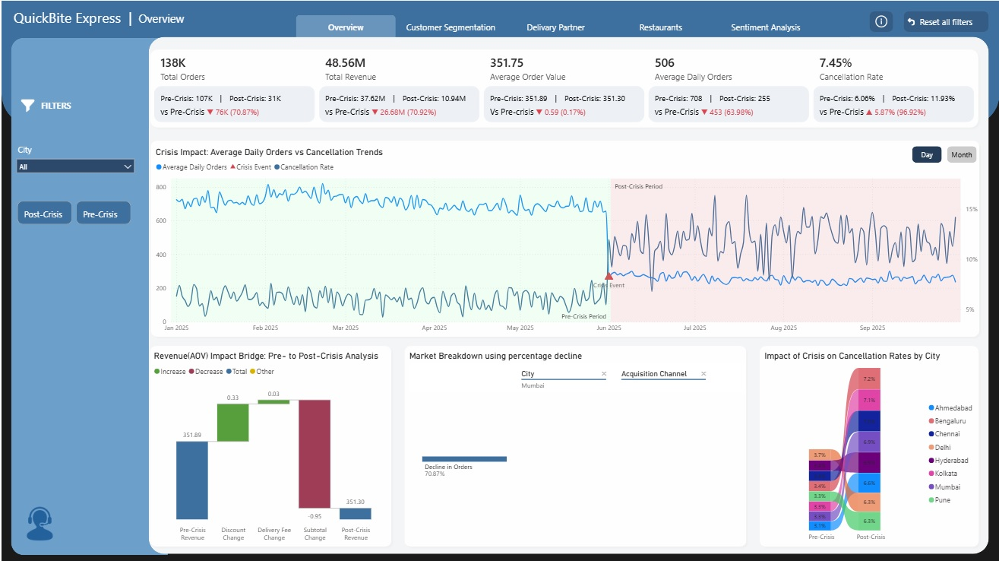
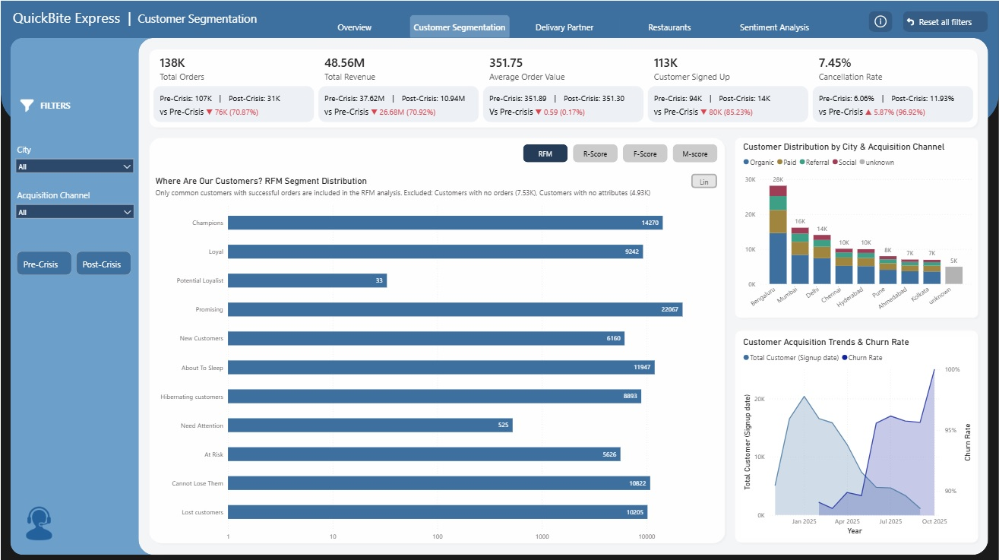
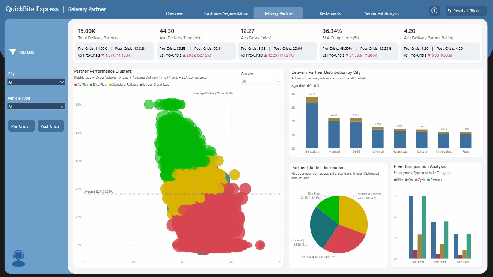
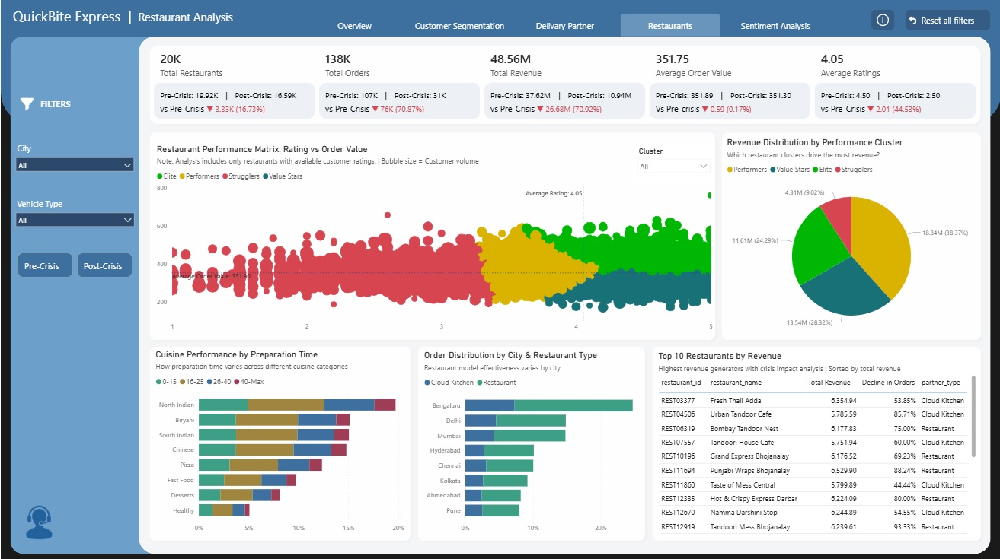
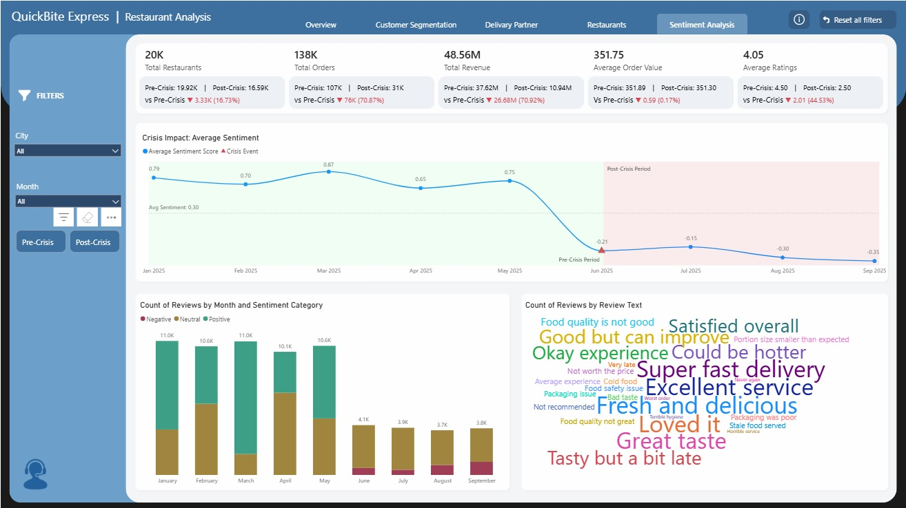

# QuickBite Express – 2025 Crisis Recovery Analytics Report
Domain: Food Delivery &amp; Consumer Analytics | Crisis Recovery &amp; Business Strategy  

## Project Overview & Objectives
As a Data Analyst at QuickBite Express, I conducted this comprehensive audit to quantify the impact of the catastrophic "June 2025 Crisis." The objective of this report is to move beyond surface-level metrics to identify the systemic failures across logistics, merchant relations, and customer sentiment. By synthesizing data from five distinct operational layers, I have mapped the path from a stable growth period to a total platform collapse, providing the data-driven foundation required for a multi-year strategic recovery.

## Dataset Description

### fact_orders
**Purpose:** Tracks customer orders, including amounts, timestamps, and cancellation status.

| Column Name | Description |
| :--- | :--- |
| **order_id** | Unique identifier for each order. |
| **customer_id** | ID linking to the customer table. |
| **restaurant_id** | ID linking to the restaurant table. |
| **delivery_partner_id** | ID linking to the delivery partner table. |
| **order_timestamp** | Timestamp of when the order was placed. |
| **subtotal_amount** | Total cost before discounts. |
| **discount_amount** | Applied discounts. |
| **delivery_fee** | Fee charged for delivery. |
| **total_amount** | Final order amount. |
| **is_cod** | Whether the order is Cash on Delivery (Y/N). |
| **is_cancelled** | Whether the order was cancelled (Y/N). |

---

### fact_order_items
**Purpose:** Tracks individual items in each order.

| Column Name | Description |
| :--- | :--- |
| **order_id** | Links to fact_orders. |
| **item_id** | Foreign key linking to the dim_menu_item table. |
| **menu_item_id** | ID linking to the menu items table. |
| **restaurant_id** | ID linking to the restaurant table. |
| **quantity** | Quantity of the item ordered. |
| **unit_price** | Price per unit of the item. |
| **item_discount** | Discount applied to the item. |
| **line_total** | Price after applying item discount. |

---

### fact_ratings
**Purpose:** Contains ratings and review data provided by customers for each order.

| Column Name | Description |
| :--- | :--- |
| **order_id** | Links to fact_orders. |
| **customer_id** | Links to dim_customer. |
| **restaurant_id** | Links to dim_restaurant. |
| **rating** | Rating given by the customer (e.g., 1–5). |
| **review_text** | Text of the review provided by the customer. |
| **review_timestamp** | Timestamp of when the review was posted. |
| **sentiment_score** | Sentiment score calculated based on review text (-1 to +1). |

---

### fact_delivery_performance
**Purpose:** Tracks delivery performance metrics like delivery times and distance.

| Column Name | Description |
| :--- | :--- |
| **order_id** | Links to fact_orders. |
| **actual_delivery_time_mins** | Actual delivery time in minutes. |
| **expected_delivery_time_mins** | Expected delivery time based on SLA. |
| **distance_km** | Distance traveled by the delivery partner (in km). |

---

### dim_customer
**Purpose:** Captures customer onboarding, acquisition details, location, and channels.

| Column Name | Description |
| :--- | :--- |
| **customer_id** | Unique identifier assigned to each customer. |
| **signup_date** | Date when the customer signed up (DD-MM-YYYY). |
| **city** | City where the customer resides. |
| **acquisition_channel** | Source of acquisition (e.g., Organic, Paid, Referral). |

---

### dim_restaurant
**Purpose:** Contains information about the restaurants involved with QuickBite.

| Column Name | Description |
| :--- | :--- |
| **restaurant_id** | Unique identifier for each restaurant. |
| **restaurant_name** | Name of the restaurant. |
| **city** | City where the restaurant operates. |
| **cusini_type** | Type of cuisine offered (e.g., Indian, Italian, Chinese). |
| **partner_type** | Type of partnership (e.g., Third-party, In-house). |
| **avg_prep_time** | Average preparation time for orders (in minutes). |
| **is_active** | Indicates if the restaurant is currently active (Yes/No). |

---

### dim_delivery_partner
**Purpose:** Contains details about the delivery partners.

| Column Name | Description |
| :--- | :--- |
| **delivery_partner_id** | Unique identifier for each delivery partner. |
| **partner_name** | Name of the delivery partner. |
| **city** | City where the delivery partner operates. |
| **vehicle_type** | Vehicle used (e.g., Bike, Scooter, Cycle). |
| **employment** | Employment status (e.g., Full-time, Part-time, Contract). |
| **avg_rating** | Average customer rating for the partner (1 to 5). |
| **is_active** | Indicates if the delivery partner is currently active (Yes/No). |

---

### dim_menu_item
**Purpose:** Contains details about menu items offered by restaurants.

| Column Name | Description |
| :--- | :--- |
| **menu_item_id** | Unique identifier for each menu item. |
| **restaurant_id** | Links to dim_restaurant. |
| **item_name** | Name of the item (e.g., Veg Biryani). |
| **category** | Category of the item (e.g., Starter, Main Course). |
| **is_veg** | Indicates if the item is vegetarian (Yes/No). |
| **price** | Price of the menu item. |

## Executive Summary of the 2025 Crisis
In June 2025, QuickBite Express experienced a localized operational failure that rapidly escalated into a systemic brand crisis. 
- **Revenue Impact:** Total revenue plummeted by **70.92%** ($26.68M loss), driven by a **63.98% drop in daily order volume**.
- **Logistical Collapse:** Delivery delays surged by **147.21%**, causing SLA compliance to crash to a terminal **12.23%**.
- **Customer Sentiment:** Average sentiment inverted from **+0.75 to -0.35**, with "Organic" users—the platform's highest-value cohort—showing the highest rate of abandonment (**77.39% decline**).

---

## Deep-Dive: 5-Pillar Dashboard Analysis

### 1. Overview Dashboard (Systemic Impact)
  

**Functionality:** This "Command Center" view benchmarks Pre-vs-Post Crisis KPIs. Stakeholders interact with it to view revenue bridges and geographic market breakdowns.
- **Insight 1:** **Daily Orders** dropped from 708 to 255 immediately post-event, a 63.98% collapse.
- **Insight 2:** **Cancellation Rates** doubled from 6.06% to 11.93%, signaling a total breakdown in user trust.
- **Insight 3:** **Organic Channels** were hit hardest (-77.39%), indicating the crisis alienated the most loyal users.
- **Insight 4:** **Average Order Value (AOV)** remained flat (-0.17%), proving the crisis is a volume/frequency issue, not a basket-size issue.
- **Insight 5:** **Geographic Uniformity:** Every major metro city saw identical patterns of decline, pointing to a central systemic failure.

### 2. Customer Segmentation (Loyalty Fragmentation)
  

**Functionality:** Employs an RFM (Recency, Frequency, Monetary) model. Analysts use the "Drill Through" to export lists of high-value "Champions" for targeted retention.
- **Insight 1:** **New Signups** fell by 85.23%, effectively killing the brand's growth engine.
- **Insight 2:** The **"Promising" Segment** (22K users) has hit a 100% churn rate, failing to convert to loyalists.
- **Insight 3:** **12% of Customers (Champions)** generate 25% of total revenue; this is the critical recovery group.
- **Insight 4:** 54% of Champions are **Organic**, underscoring the danger of losing natural brand advocates.
- **Insight 5:** **Bengaluru** is the core revenue hub, holding nearly double the Champions of any other city.

### 3. Delivery Partner Analysis (Logistical Backbone)
  

**Functionality:** Audits fulfillment reliability. Users drill through the "At-Risk" cluster to identify specific partners for retraining or offboarding.
- **Insight 1:** **SLA Compliance** crashed by 72%, leaving only 12% of orders arriving on time.
- **Insight 2:** **Average Delays** rose to 20.64 mins (a 147% increase), breaking the "Express" value proposition.
- **Insight 3:** Over **50% of the Fleet** is now categorized as "At-Risk" or "Under-Optimized."
- **Insight 4:** High reliance on **Contract/Part-time** labor contributed to the inability to scale during the crisis.
- **Insight 5:** **Rating Paradox:** Ratings held at 4.20, suggesting users blame the platform/tech, not the individual drivers.

### 4. Restaurant Analysis (Merchant Health)
  

**Functionality:** Tracks merchant quality and prep times. The "Revenue Bridge" identifies which cuisines drive volume and which are bottlenecks.
- **Insight 1:** **Merchant Churn** hit 16.73%, with 3.33K restaurants leaving the platform post-crisis.
- **Insight 2:** **Average Ratings** crashed from 4.5 to 2.5, a 44% decline in perceived quality.
- **Insight 3:** **Anchor Decline:** Top-tier restaurants saw order volume drops as high as 93%.
- **Insight 4:** **Prep-Time Bottlenecks:** North Indian and Biryani items frequently exceed 40-minute prep times, exacerbating delivery delays.
- **Insight 5:** **Resilient Categories:** Beverages and Starters (specifically Sweet Lassi) remain the highest-performing assets.

### 5. Sentiment Analysis (Voice of the Customer)
  

**Functionality:** Translates feedback into emotional scoring. The Word Cloud visualizes the primary drivers of negative sentiment.
- **Insight 1:** Sentiment bottomed out at **-0.35**, with no signs of recovery 4 months post-crisis.
- **Insight 2:** **Review Volume** dropped by 65%, and the remaining volume is almost entirely negative/neutral.
- **Insight 3:** "Cold food" and "Very late" are the dominant themes, linking logistics directly to quality perception.
- **Insight 4:** **Perceived Value** has collapsed, with "Not worth the price" trending despite stagnant AOV.
- **Insight 5:** **Food Safety** mentions have emerged, indicating the delays are causing real product degradation.

---

## Root Cause & Systemic Vulnerability Assessment
The data suggests a **Cascading Failure Loop**: 
1. Centralized dispatch/system error (The Crisis) led to initial delays.
2. Initial delays caused food to arrive "Cold," destroying Restaurant Ratings (4.5 -> 2.5).
3. Degraded quality drove Organic users to abandon the app (-77% orders).
4. Reduced volume led to Partner demotivation, further crashing SLA (12%).
5. The platform is now stuck in a low-volume, high-delay, negative-sentiment equilibrium.

## Customer Impact & Churn Segmentation
| Segment | Recovery Probability | Strategic Action |
| :--- | :--- | :--- |
| **Champions** | High | Personalized "We Miss You" credits + VIP Delivery priority. |
| **Promising** | Medium | Free "Express" guarantee for next 5 orders to rebuild habit. |
| **At-Risk** | Low | Deep discounting via Paid channels to re-acquire. |
| **Lost** | Very Low | Long-term brand re-positioning; do not spend on direct ads yet. |

## Strategic Recovery Plan

### Short-Term (0-3 Months): Stabilize the Core
- **Fleet Purge:** Offboard the bottom 10% of the "At-Risk" partner cluster.
- **Incentivize Speed:** Implement a "Late Order = Free Order" policy for the Top 100 Bengaluru restaurants to regain Champion trust.
- **KPI Target:** Move SLA Compliance from 12% to 30%.

### Mid-Term (4-12 Months): Rebuild Merchant Quality
- **Menu Optimization:** Prioritize "Quick Prep" categories (Beverages/Starters) in search rankings.
- **Merchant Recovery Fund:** Offer commission breaks to the 3.3K restaurants that churned to rejoin the platform.
- **KPI Target:** Restore Average Ratings to 3.5.

### Long-Term (12-24 Months): Brand Re-Acquisition
- **Organic SEO/Social Push:** Move spend from Paid to Organic to rebuild the "natural" user base.
- **Systemic Redundancy:** Overhaul dispatch algorithms to prevent the single-point-of-failure seen in June 2025.
- **Expected ROI:** 2.5x Revenue growth by 2027 by recapturing the lost $26M market share.

## Tools & Technologies Used

**Data Visualization & Reporting:**
* **Power BI Desktop:** Developed a comprehensive 5-page interactive analytical suite.
* **Visual Toolkit:** Utilized multi-layered visuals including KPI Cards, Cluster Charts, Decomposition Trees, Donut Charts, WaterFall Charts, Ribbon Charts, and Word Clouds.
* **DAX Used:** Engineered complex logic using functions such as `CALCULATE`, `SWITCH`, `IF`, `DIVIDE`, `DISTINCTCOUNT`, `SUMMARIZE`, `TREATAS`, and `ALLEXCEPT`.
* **Power Query (M Language):** Employed for robust ETL processes, data cleaning, and schema transformation.

**Data Analysis & Modeling:**
* **Analytical Measures:** Created 60+ custom DAX measures for dynamic customer segmentation (RFM), and crisis ROI impact.
* **Statistical Modeling:** Implemented trend analysis, statistical aggregations, and  pre-vs-post crisis performance.
* **Relational Schema:** Designed a Star Schema consisting of 4 Fact tables (`fact_orders`, `fact_order_items`, `fact_ratings`, `fact_delivery_performance`) and 4 Dimension tables (`dim_customer`, `dim_restaurant`, `dim_delivery_partner`, `dim_menu_item`).

## Live Dashboard Link
The interactive dashboard can be accessed [Live_Dashboard](https://app.powerbi.com/view?r=eyJrIjoiMjVlNTcxYjAtMWUyOS00OGQwLTg5NTEtOTIzZTJmMjRiNTRkIiwidCI6ImM2ZTU0OWIzLTVmNDUtNDAzMi1hYWU5LWQ0MjQ0ZGM1YjJjNCJ9)
